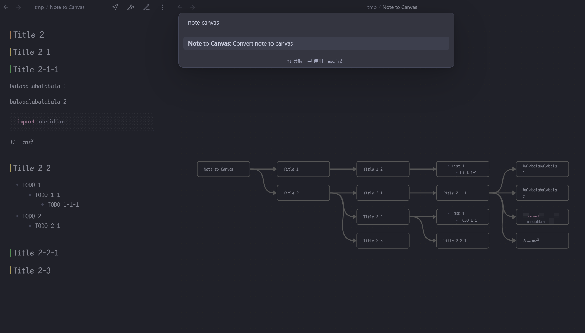

# Obsidian Convert Note to Canvas

This is an Obsidian plugin that converts your note files to a canvas according to the Markdown structure.

## Installation

In Obsidian go to `Settings > Third-party plugins > Community Plugins > Browse` and search for [`Better Export PDF`](obsidian://show-plugin?id=better-export-pdf).

### Manual installation

1. Download the .zip file from [the latest Release](https://github.com/l1xnan/obsidian-better-export-pdf/releases), or from any other release version.
2. Unzip into: `{VaultFolder}/.obsidian/plugins/`
3. Reload Obsidian and enable the plug-in.

or use the [BRAT Plugin](https://obsidian.md/plugins?id=obsidian42-brat).

## Usage

Open the command panel and select `Note to Canvas`.

## Support This Plugin

This plugin takes a lot of work to maintain and continue adding features. If you want to fund the continued development of this plugin you can do so here:

 

[WeChat or Alipay](./README.zh.md#赞助)

